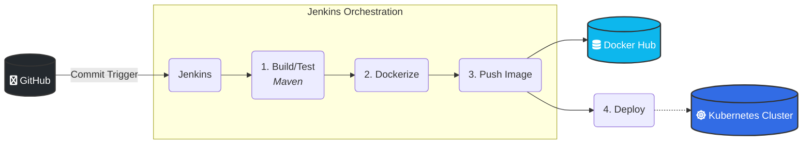

```markdown
# DevOps CI/CD Pipeline: Automated Java Application Deployment

[](https://maven.apache.org/)
[](https://www.jenkins.io/)
[](https://www.docker.com/)
[](https://kubernetes.io/)
[](https://www.ansible.com/)

## 🌐 Project Overview

A fully automated, end-to-end CI/CD pipeline for a Java Maven application. This project demonstrates the integration of Jenkins, Docker, Ansible, and Kubernetes to achieve reliable, scalable deployment from source code commit to running service.

---

## 🏛️ Architecture & Workflow

This pipeline automates the build, test, containerization, and deployment processes.


*(**Ansible** is used for environment configuration management and provisioning of the underlying infrastructure.)*

## 🛠 Tech Stack

| Domain | Technologies Used |
| :--- | :--- |
| **Application/Build** | Java, Maven |
| **CI/CD Orchestration** | Jenkins (`Jenkinsfile`) |
| **Infrastructure as Code**| Ansible, Kubernetes YAML |
| **Containerization** | Docker, Docker Hub |
| **Orchestration** | Kubernetes (K8s) |

## ✨ Key Achievements & Features

This project showcases strong competency in core DevOps principles:

- ✅ **Pipeline as Code:** The entire CI/CD process is defined declaratively in the [`Jenkinsfile`](Jenkinsfile).
- ✅ **Infrastructure as Code (IaC):** Environment configuration managed via [`Ansible`](ansible/) roles; application state defined in [`k8s/`](k8s/) manifests.
- ✅ **Immutable Infrastructure:** Application artifacts are built once as Docker images and deployed consistently across environments.
- ✅ **Automated Testing & Building:** Maven handles automated unit testing and packaging (WAR file generation).
- ✅ **Container Orchestration:** Kubernetes manages deployment, scaling, and service exposure.

## 📁 Project Highlights

| File/Directory | Description |
| :--- | :--- |
| [`Jenkinsfile`](Jenkinsfile) | The blueprint for the CI/CD pipeline stages. |
| [`Dockerfile`](Dockerfile) | Defines the container image for the Java application. |
| [`k8s/`](k8s/) | Kubernetes manifests for `Deployment` and `Service`. |
| [`ansible/`](ansible/) | Roles and playbooks for infrastructure configuration management. |
| `pom.xml` | Maven configuration for dependencies and build lifecycle. |

## 🚀 Prerequisites

To execute this pipeline, the following infrastructure is required:

1.  **Jenkins Server:** Configured with Docker and necessary plugins (Git, Docker Pipeline).
2.  **Kubernetes Cluster:** An active K8s cluster (e.g., Minikube, EKS).
3.  **Credentials:** Jenkins must have stored credentials for Docker Hub access and Kubeconfig authentication.

## 📫 Contact

**Jacek Wolnicki**

- **LinkedIn:** [linkedin.com/in/jacek-wolnicki](https://www.linkedin.com/in/jacek-wolnicki/)
- **Project Repository:** [https://github.com/jacekwolnickikrk/FinalDevOpsProject](https://github.com/jacekwolnickikrk/FinalDevOpsProject)
```
